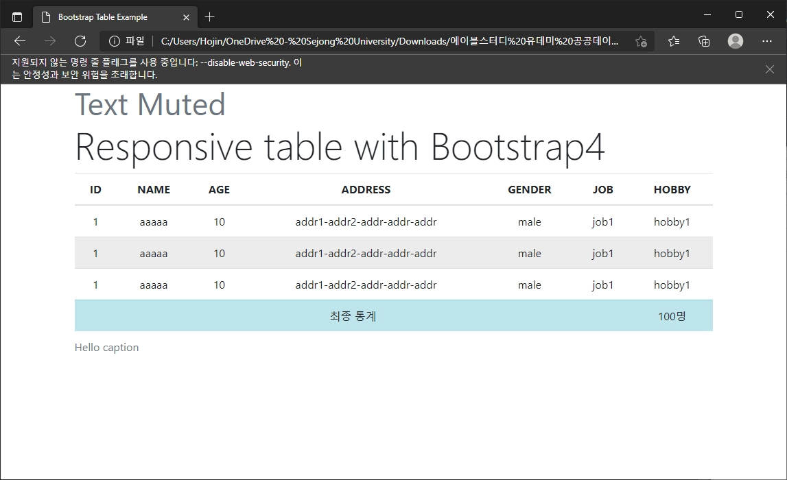
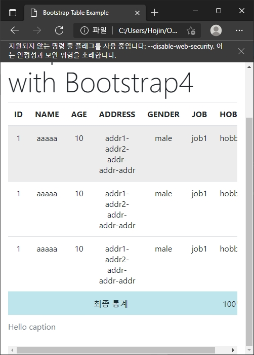

# ablestudy 2022-02-26
- 컨테이너 없이 테이블만 작성하면 너비가 100% 꽉 찬다.
- 테이블 외곽에 div 쓰고 class=table 적용하면 양쪽에 적절한 마진이 생긴다.
- table bordered, striped, dark, light 
	- https://getbootstrap.com/docs/5.1/content/tables/#bordered-tables
- text-center. 가운데정렬.
- thead-dark
- colspan. https://www.w3schools.com/html/html_table_colspan_rowspan.asp
- table-hover, table-sm
- table-info, danger, success
- bg-info -danger, -success
- table-responsive-xx (sm, md, lg, xl) https://getbootstrap.com/docs/5.1/content/tables/#responsive-tables
- Responsive Table
	- 기본 
	- 화면 작아졌을 때


## Code
```html
<html>
<head>
    <meta chcarset="utf-8">
    <title>Bootstrap Table Example</title>

    <!-- Bootstrap. VERSION MUST MATCH -->
    <script src="http://code.jquery.com/jquery-latest.min.js"></script>
    <link rel="stylesheet" href="https://cdn.jsdelivr.net/npm/bootstrap@4.6.0/dist/css/bootstrap.min.css">

</head>
<body>
<div class="container">
    <h3 class="display-4">
        <small class="text-muted">Text Muted</small>
        <br>Responsive table with Bootstrap4
    </h3>
    <div class="table-responsive">
    <table class="table table-hover text-center table-center">
        <thead class="">
            <tr>
                <th>ID</th>
                <th>NAME</th>
                <th>AGE</th>
                <th>ADDRESS</th>
                <th>GENDER</th>
                <th>JOB</th>
                <th>HOBBY</th>
            </tr>
        </thead>
        <tbody>
            <tr>
                <td>1</td>
                <td>aaaaa</td>
                <td>10</td>
                <td>addr1-addr2-addr-addr-addr</td>
                <td>male</td>
                <td>job1</td>
                <td>hobby1</td>
            </tr>
            <tr>
                <td>1</td>
                <td>aaaaa</td>
                <td>10</td>
                <td>addr1-addr2-addr-addr-addr</td>
                <td>male</td>
                <td>job1</td>
                <td>hobby1</td>
            </tr>
            <tr>
                <td>1</td>
                <td>aaaaa</td>
                <td>10</td>
                <td>addr1-addr2-addr-addr-addr</td>
                <td>male</td>
                <td>job1</td>
                <td>hobby1</td>
            </tr>
            <tr class="table-info"> 
                <td colspan=6>최종 통계</td>
                <td>100명</td>
            </tr>
        </tbody>
        <caption>Hello caption</caption>
    </table>
    </div>
</div>
</body>
</html>
```


